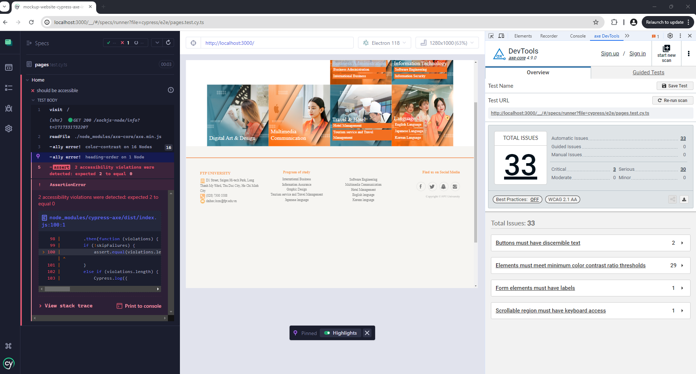
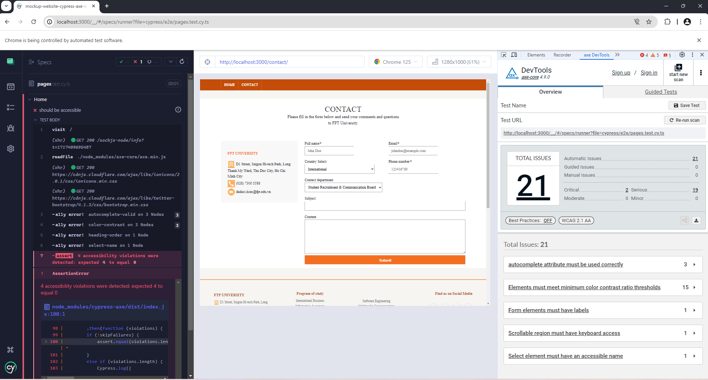
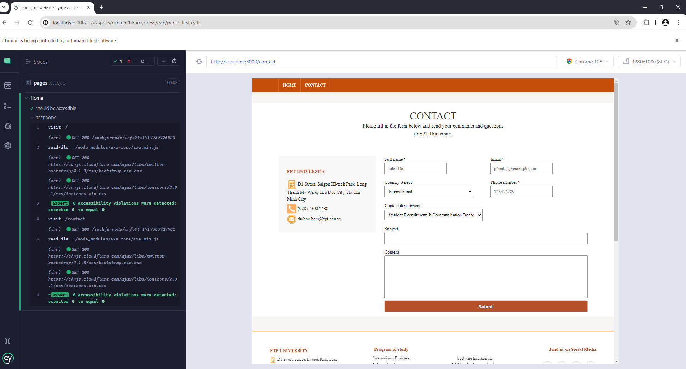
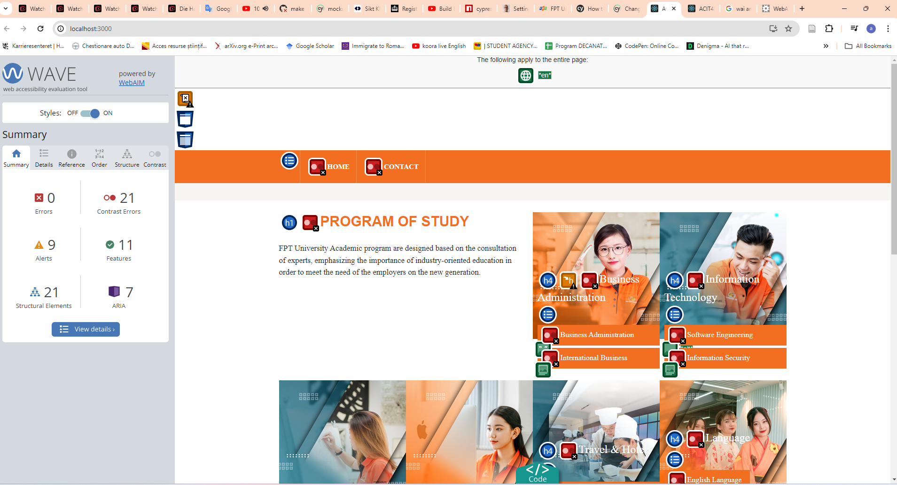
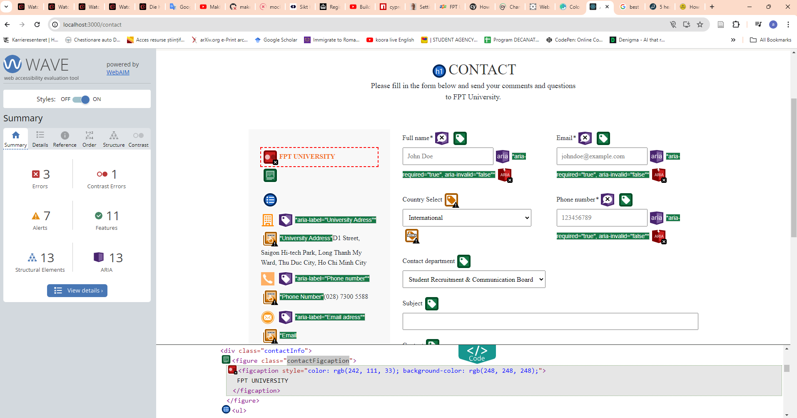
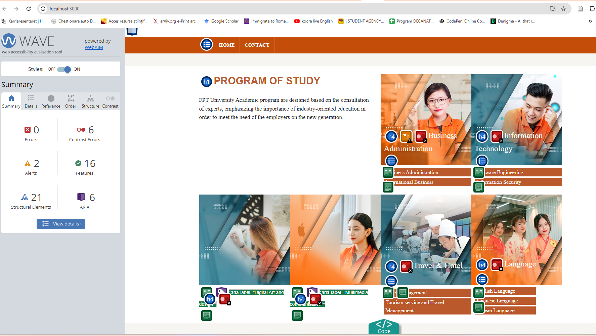
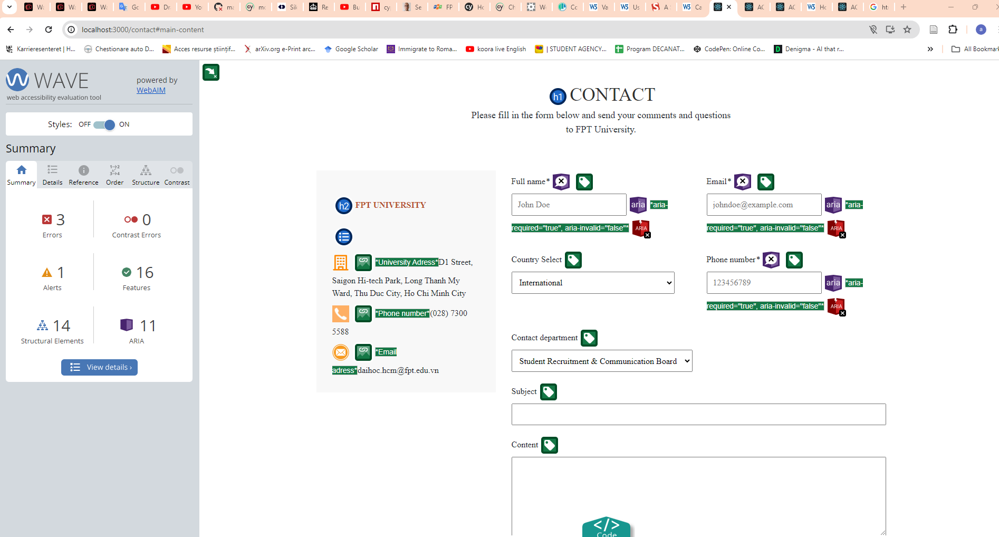

# this project is an on giong work in progress

this project runs on old version of node " nvm use 16.13.2"

# Accessible University Website Prototype - CI/CD Accessibility Testing

This project is an extension of a school project conducted by my group, where we reviewed the accessibility of two pages of a university website. The goal of this current project is to build upon that foundation by implementing accessibility testing as part of a Continuous Integration (CI) pipeline.

## The Importance of Automated Accessibility Testing

Integrating automated accessibility testing into the development process can greatly improve the accessibility of a website from the early stages of development. It encourages developers to write code with accessibility in mind and helps catch potential issues early.

However, it's important to note that while automated testing is a valuable tool, it does not replace manual testing. Automated tests can't fully replicate a user's journey or catch every possible accessibility issue.

## Tools and Processes

We've implemented linting in our VS Code environment and integrated Cypress Axe for automated accessibility testing through GitHub Actions.

Here are some screenshots demonstrating the utility of these tools:

- Errors detected by simple automated testing in the browser using Axe,wave and cypress axe by creating a cypress test:
  <!-- TODO: Add image references here -->
  <!--  -->

And now below are the results of the test after iterating fixes we for the accessibility issues caught by cypress axe.

Below are a11y issues shown after test with wave on the browser

And now below are the results of the test after iterating fixes we for the accessibility issues caught by cypress axe and the errors wave caught as well.

some of the browser extension like wave how an invalid aria-decribeby, however the code that execute as intended, with screen readers as well and it does show the alert message as supposed. 

## Links

- (https://daihoc.fpt.edu.vn/en/)(#) 
- (https://github.com/alhousseiny12345gueye/Accessible-University-wesite-prototype)(#) 

This project serves as an exploration of how incorporating accessibility testing into a CI pipeline can enhance the accessibility of a website.